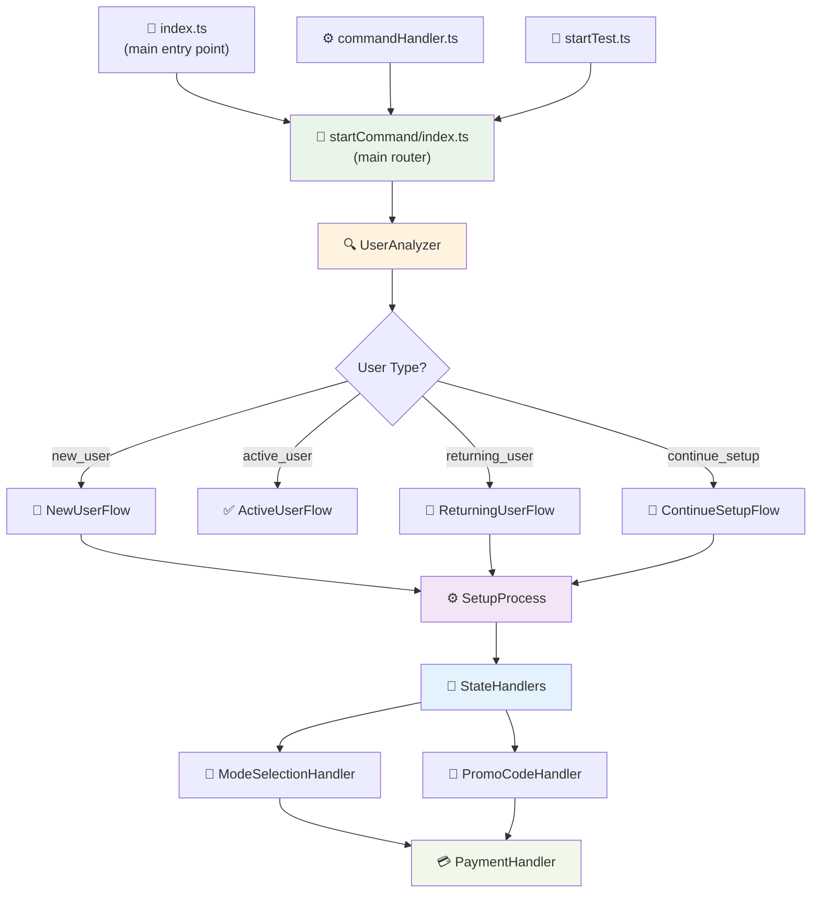

# StartCommand Module Architecture

Модульная архитектура для обработки команды `/start` в Telegram боте.

## 📊 Диаграмма архитектуры



## 📁 Структура файлов

```
startCommand/
├── README.md                   # 📖 Документация (этот файл)
├── index.ts                    # 🔄 Главный роутер
├── UserAnalyzer.ts             # 🔍 Анализ типа пользователя
├── flows/                      # 📋 Flows для разных типов пользователей
│   ├── NewUserFlow.ts          # 📝 Новые пользователи
│   ├── ActiveUserFlow.ts       # ✅ Уже активные пользователи
│   ├── ReturningUserFlow.ts    # 👋 Возвращающиеся пользователи
│   └── ContinueSetupFlow.ts    # 🔄 Продолжение настройки
└── states/                     # ⚙️ Обработчики состояний
    ├── index.ts                # 🎯 Центральные обработчики
    ├── SetupProcess.ts         # ⚙️ Процесс настройки
    ├── ModeSelectionHandler.ts # 📝 Выбор режима
    ├── PromoCodeHandler.ts     # 🎫 Обработка промокодов
    └── PaymentHandler.ts       # 💳 Обработка платежей
```

## 🔄 Как это работает

### 1. Анализ пользователя
`UserAnalyzer` определяет тип пользователя:
- **new_user** - новый пользователь или существующий в БД но новый для чата
- **active_user** - уже активный пользователь (in_chat = true)
- **continue_setup** - пользователь в процессе настройки (user_state != null)
- **returning_user** - возвращающийся пользователь (joined_at != null)

### 2. Маршрутизация Flow
Главный роутер (`index.ts`) направляет к соответствующему Flow:

#### NewUserFlow
- Отправляет приветствие
- Запускает процесс настройки режима

#### ActiveUserFlow  
- Отправляет сообщение что пользователь уже активен

#### ReturningUserFlow
- Проверяет сохраненные дни подписки
- Направляет в чат (если есть дни) или на настройку

#### ContinueSetupFlow
- Продолжает с того места где остановился пользователь
- Обрабатывает состояния: waiting_mode, waiting_promo, payment_link_sent

### 3. Обработка состояний
`StateHandlers` управляют переходами между состояниями:

#### SetupProcess
- Отправка клавиатуры для выбора режима
- Управление состояниями пользователя в БД

#### ModeSelectionHandler
- Сохраняет выбранный режим (text/image)
- Автоматически назначает ритм daily
- Переходит к проверке оплаты

#### PromoCodeHandler
- Валидирует промокоды
- Устанавливает статус клуба

#### PaymentHandler
- Проверяет статус клуба и сохраненные дни
- Отправляет соответствующие ссылки на оплату

## 🎯 Преимущества архитектуры

1. **Чёткое разделение ответственности** - каждый класс отвечает за одну задачу
2. **Легко читается** - понятно что происходит на каждом этапе  
3. **Легко тестировать** - можно тестировать каждый компонент отдельно
4. **Легко расширять** - добавление нового типа пользователя или состояния не влияет на остальной код
5. **Модульность** - импорты идут напрямую к нужным модулям

## 📝 Логика работы (по logic.md)

Модуль реализует логику **A1. /start → регистрация/актуализация пользователя** из `logic.md`:

1. **Регистрация/актуализация** - UserAnalyzer
2. **Проверка активности** - маршрутизация Flow  
3. **Приветственное сообщение** - соответствующий Flow
4. **Выбор режима** - SetupProcess + ModeSelectionHandler
5. **Автоматическое назначение ритма** - daily для всех режимов
6. **Проверка оплаты** - PaymentHandler

## 📈 Упрощения в стартовом сценарии

- **Убран выбор ритма** - автоматически назначается `daily` для всех режимов
- **Отдельная команда ChangePace** - для тех, кто хочет изменить ритм позже
- **Упрощенный флоу** - режим → оплата (без промежуточного выбора ритма)

## 🔧 Константы

Все текстовые сообщения и настройки берутся из `/supabase/functions/constants.ts`:
- MSG_WELCOME, MSG_WELCOME_ALREADY_ACTIVE - приветствия
- MSG_MODE - выбор режима
- MSG_PROMO, MSG_PROMO_ERR - промокоды
- MSG_LINK_CLUB, MSG_LINK_STANDARD - ссылки на оплату
- AVAILABLE_MODES - доступные режимы
- AVAILABLE_PACES.DAILY - автоматически назначаемый ритм
- VALID_PROMO_CODES - валидные промокоды

## 📥 Импорты

Для использования модуля:

```typescript
// Основные функции
import { handleStartCommand, handleStartCallbackQuery } from "./startCommand/index.ts";

// Обработчики состояний  
import { handleModeSelection, handlePromoCode, handleNoPromo } from "./startCommand/states/index.ts";
``` 